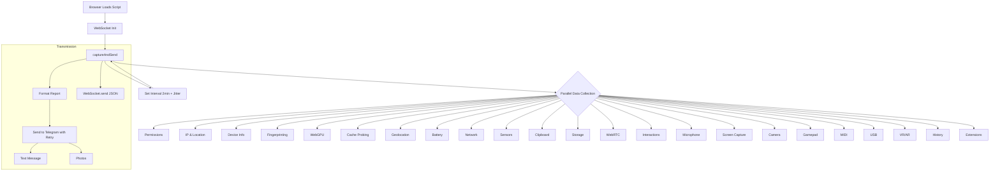

<p align="center">
  
</p>

<p align="center">
  <a href="https://github.com/Ali-hey-0/Browser-Data-Logger">
    
  </a>
  <a href="https://github.com/Ali-hey-0/Browser-Data-Logger/stargazers">
    
  </a>
  <a href="https://github.com/Ali-hey-0/Browser-Data-Logger/network/members">
    
  </a>
  <a href="https://github.com/Ali-hey-0/Browser-Data-Logger/issues">
    
  </a>
  <a href="https://github.com/Ali-hey-0/Browser-Data-Logger/blob/main/LICENSE">
    
  </a>
</p>

<br/>

> **A single JavaScript payload that captures 40+ data points from a visitor's browser – from battery level to camera snapshot – and delivers them in real time to your Telegram bot and WebSocket server.**  
> **For authorised security research, device fingerprinting studies, and educational use only.**

<br/>

---

## 📑 Table of Contents

- [🔭 Overview](#-overview)
- [✨ Features (Complete List)](#-features-complete-list)
- [🧠 Architecture & Data Flow](#-architecture--data-flow)
- [⚡ Quick Start](#-quick-start)
- [⚙️ Configuration](#️-configuration)
- [🤖 Telegram Bot Setup](#-telegram-bot-setup)
- [📡 WebSocket Server Setup](#-websocket-server-setup)
- [📊 Example Output](#-example-output)
- [📖 Detailed Data Categories](#-detailed-data-categories)
- [🔒 Security & Privacy](#-security--privacy)
- [🛠️ Troubleshooting](#️-troubleshooting)
- [❓ FAQ](#-faq)
- [🗺️ Roadmap](#️-roadmap)
- [🤝 Contributing](#-contributing)
- [📜 License](#-license)
- [📬 Contact](#-contact)
- [🙏 Acknowledgements](#-acknowledgements)

---

## 🔭 Overview

**Browser Data Logger** is a pure JavaScript (ES6+) script that, once loaded in a browser, silently collects a **comprehensive snapshot** of the device, network, user interactions, and environmental sensors. All data is packaged into a human‑readable report and transmitted simultaneously over two channels:

- **Telegram Bot** – receives the full text report plus optional camera and screen captures.
- **WebSocket** – streams individual data points as JSON for integration with custom dashboards, SIEMs, or analysis pipelines.

The script is modular, error‑resilient, and automatically re‑runs every ~2 minutes to provide continuous updates on battery, network conditions, clipboard content, and more.

> ⚠️ **IMPORTANT**  
> This tool is **strictly for ethical use** – only on devices you own or have written permission to test. Unauthorised deployment may violate laws like GDPR, CCPA, CFAA, and others.

---

## ✨ Features (Complete List)

Every aspect of the browser environment is fingerprinted. Below is the exhaustive set of data points captured:

| Category | Data Collected |
|----------|----------------|
| **🔐 HTTPS Detection** | Protocol (HTTP/HTTPS), security warning if insecure |
| **🔑 Permissions** | Camera, geolocation, microphone, notifications, MIDI, USB |
| **🌐 Network** | Public IP (via `ipify`), ISP, ASN, city, region, country, postal code, timezone, approximate coordinates (via `ipapi.co`) |
| **📍 Geolocation** | High‑accuracy GPS (lat, lon, altitude, heading, speed, accuracy), reverse‑geocoded street address via Nominatim |
| **🖥️ Device Info** | User‑agent, platform, language, screen resolution, color depth, pixel ratio, timezone, CPU cores, device memory, touch support, webdriver flag, referrer, full URL, window size, orientation, JS heap memory, page load timing |
| **🖌️ Fingerprinting** | Canvas fingerprint, WebGL renderer/vendor/extensions, WebAudio fingerprint, font enumeration, WebAssembly support |
| **🎮 GPU** | WebGPU adapter info (device, vendor, architecture) |
| **🕵️ Cache Probing** | Visited website detection (Facebook, X, LinkedIn, Instagram, GitHub) via timing attacks |
| **🔋 Battery** | Level, charging status, charging/discharging time (live updates on change) |
| **📶 Network Connection** | Effective type (4G, WiFi…), downlink speed, RTT, data‑saver mode (live updates) |
| **📳 Sensors** | Accelerometer (X, Y, Z), gyroscope (alpha, beta, gamma), ambient light (lux) |
| **📋 Clipboard** | Current clipboard content (if secure context), updates on paste event |
| **💾 Storage** | Cookies, `localStorage`, `sessionStorage`, IndexedDB availability |
| **🖧 WebRTC** | Local IP addresses leaked via STUN/TURN |
| **🎤 Microphone** | Audio frequency spectrum metadata (via AnalyserNode) |
| **📸 Camera** | Snapshot photo (jpeg) from front/back camera (with fallback logic) |
| **🖥️ Screen Capture** | Screenshot of user’s entire screen (jpeg) after user consent prompt |
| **⌨️ Interactions** | Keystrokes (key + timestamp), mouse moves (X, Y + timestamp), clicks |
| **🎮 Gamepad** | Connected gamepad IDs, button/axes count, live connect events |
| **🎹 MIDI** | Input/output device names |
| **🔌 USB** | Connected USB devices (vendor/product ID, name), live connect events |
| **🥽 VR/AR** | WebXR session support (`immersive-vr`) |
| **📜 History** | Browsing history length, last history state |
| **🧩 Extensions** | Detection of uBlock Origin, AdBlock, Privacy Badger, NoScript via chrome‑extension:// probing |
| **⚠️ Errors** | Detailed error logs for every failed module |

All captured photos are sent as actual images to Telegram. The textual report is intelligently truncated to fit Telegram’s 4096‑character limit.

---

## 🧠 Architecture & Data Flow



Key Design Decisions:

· Parallel execution: All data collectors run simultaneously via Promise.all to minimise load time.
· Caching: Static fingerprints (device info, canvas/webgl) are cached in cachedData to avoid redundant heavy operations.
· Retry logic: Telegram messages and photos use exponential backoff (1s, 2s, 4s, 8s, 16s) for up to 5 attempts.
· Graceful degradation: If a module fails, its error is logged and included in the final report – nothing breaks the whole chain.
· Re‑collection loop: A jittered interval (120000ms + random(0-1000)ms) re‑runs the capture, allowing live monitoring of mutable states.

---

⚡ Quick Start

1. Clone the repository
   ```bash
   git clone https://github.com/Ali-hey-0/Browser-Data-Logger.git
   cd Browser-Data-Logger
   ```
2. Open index.html (or create your own HTML file) and insert the script. Set your configuration constants (see Configuration).
3. Serve over HTTPS
      For local testing, generate a self‑signed certificate or use a tool that provides SSL automatically:
   ```bash
   npx serve . --ssl
   # or
   python3 -m http.server 8000  # (only if you don't need secure APIs)
   ```
   Camera, microphone, screen capture, and geolocation require a secure context (HTTPS or localhost). For development, you can also launch Chrome with --unsafely-treat-insecure-origin-as-secure="http://your-domain".
4. Open the page in your browser. The script runs automatically. Check your Telegram bot for the report.

---

⚙️ Configuration

At the top of the script (java.js or inline <script>), replace the placeholders with your own values:

```javascript
const BOT_TOKEN = '7944060864:AAGvE3ngz4nQYN9ZglGN1-5jHgnok0kyRUY';  // ← Replace with your bot token
const CHAT_ID   = 'YOUR_TELEGRAM_CHAT_ID';                       // ← Replace with your chat ID
const DEBUG     = false;                                         // Set true for console logs
const WS_URL    = 'wss://your-websocket-server.com';             // WebSocket endpoint
```

· BOT_TOKEN – obtained from @BotFather on Telegram.
· CHAT_ID – your personal numeric ID or a group chat ID (see Telegram Bot Setup).
· WS_URL – a WebSocket server that will receive JSON data in real time. Leave as an empty string if not using WebSockets (the script will fall back gracefully).
· DEBUG – enable to see verbose logs in the browser console (useful for debugging permissions or network errors).

---

🤖 Telegram Bot Setup

1. Create a bot
      In Telegram, search for @BotFather, send /newbot, choose a name and username. You will receive a token like 123456:ABCdef....
2. Obtain your chat ID
   · Send any message (e.g., “/start”) to your bot.
   · Visit this URL in your browser:
          https://api.telegram.org/bot<YOUR_BOT_TOKEN>/getUpdates
   · Look for the "chat":{"id":123456789} field. That number is your CHAT_ID.
3. Configure the script with the token and chat ID.
4. Test by loading the page. Your bot should receive:
   · A multi‑line text message containing all collected information.
   · Separate photo messages (camera capture + screen capture), if the browser allowed them.

---

📡 WebSocket Server Setup

To view live JSON streams, you can run any WebSocket echo or relay server. Below are two quick options.

Option 1: Node.js with ws (recommended)

```bash
npm init -y
npm install ws
```

Create server.js:

```javascript
const WebSocket = require('ws');
const wss = new WebSocket.Server({ port: 8080 });

wss.on('connection', ws => {
  console.log('Client connected');
  ws.on('message', data => console.log('Received:', data.toString()));
});

console.log('WebSocket server running on ws://localhost:8080');
```

Run with node server.js. Set WS_URL = 'ws://localhost:8080' (or wss:// in production with a reverse proxy).

Option 2: wscat for quick testing

```bash
npm install -g wscat
wscat -l 8080
```

It will print every message to the console.

The script sends JSON objects like:

```json
{"ipDetails":{"city":"Berlin","country":"Germany",...}}
{"geolocation":{"latitude":52.52,"longitude":13.405,...},"address":"Unter den Linden..."}
{"interaction":"Key:a:123456"}
{"camera":{"photo":"data:image/jpeg;base64,..."}}
```

---

📊 Example Output

Telegram Message Preview
(truncated for brevity; actual output is ~3000–4000 characters)

```
Device Info (2026-07-21T14:22:10.123Z):
HTTPS: Yes
Permissions: {"camera":"granted","geolocation":"prompt",...}
IP: 203.0.113.42
IP Location: Berlin, Berlin, Germany
ISP: Example Internet GmbH
IP Coords: 52.520008, 13.404954
Postal: 10178
Timezone: Europe/Berlin
ASN: AS12345
userAgent: Mozilla/5.0 (Windows NT 10.0; Win64; x64) AppleWebKit/537.36 ...
screenResolution: 1920x1080
timeZone: Europe/Berlin
...
Geo: Lat:52.5200, Lon:13.4050, Acc:12m, Alt:N/A, Head:N/A, Speed:N/A
Address: 1, Unter den Linden, Mitte, Berlin, 10117, Germany
AddrDetails: Unter den Linden, Berlin, Berlin, Deutschland, 10117
Battery: 89.00% (Charging), CT:Infinity, DT:Infinity
Network: 4g, 10Mbps, RTT:50ms, SaveData:No
Camera: Yes, Count:2, Labels:HD Webcam, Back Camera
Photo: Captured
ScreenCapture: Captured
...
```

Photos are attached as actual images, named photo_1626854220123.jpg and screen_1626854220123.jpg.

---

📖 Detailed Data Categories

🔐 HTTPS Detection

· isSecure: boolean indicating if the page was loaded over HTTPS.
· securityWarning: message listing the APIs that are blocked in HTTP (camera, geolocation, etc.).

🔑 Permissions

Queries the Permission API for: camera, geolocation, microphone, notifications, midi, usb. States can be granted, denied, or prompt.

🌐 Network & IP

· Public IP via https://api.ipify.org?format=json (no‑cache to prevent caching).
· IP Enrichment via https://ipapi.co/json/ → city, region, country, ISP, latitude, longitude, postal, timezone, ASN.
    Cached in memory; if the next collection fails, the cached version is used as fallback.

📍 Geolocation

· Uses navigator.geolocation.getCurrentPosition with enableHighAccuracy: true, 30s timeout.
· Falls back to IP‑based coordinates if GPS fails or is denied.
· Reverse geocoding via Nominatim (nominatim.openstreetmap.org) to get a human‑readable address and detailed components (road, city, state, country, postal).
· Sent separately over WebSocket and included in the Telegram report.

🖥️ Device Info

A massive static object containing:

· userAgent, platform, language, languages (list)
· screenResolution, colorDepth, pixelRatio
· timeZone (from Intl), cpuCores (navigator.hardwareConcurrency)
· deviceMemory (GB), touchSupport (boolean), webdriver flag
· referrer, url, windowSize, orientation
· memory (used JS heap size in MB) – from performance.memory
· performanceTiming – DOM complete and load event duration

Cached indefinitely because they don’t change during a session.

🖌️ Fingerprinting

· Canvas: draws text and random noise to produce a hashable dataURL.
· WebGL: renderer string, vendor, version, and list of supported extensions.
· Audio: sample rate and max channel count via AudioContext.
· Fonts: tests a list of 13 common fonts by measuring the width of a hidden <span>.
· WebAssembly: attempts to compile a minimal WASM module to detect support.

All components are cached after the first run.

🎮 WebGPU

If available, queries navigator.gpu.requestAdapter() and extracts device, vendor, and architecture.

🕵️ Cache Probing

Times how long it takes to load favicons from popular sites. A load time under 50ms suggests the resource was cached, implying the user has visited that site. Tested sites: facebook.com, x.com, linkedin.com, instagram.com, github.com.

🔋 Battery

Uses the Battery Status API (navigator.getBattery). Reports level (0‑100%), charging state, charging time, discharging time. Additionally, registers an onchargingchange listener that sends real‑time updates to WebSocket.

📶 Network Connection

Uses navigator.connection (if available). Reports effectiveType, downlink, rtt, and saveData. Listens for changes and pushes updates.

📳 Sensors

· Accelerometer (DeviceMotionEvent) – X, Y, Z acceleration.
· Gyroscope (DeviceOrientationEvent) – alpha, beta, gamma.
· Ambient Light (AmbientLightSensor API) – illuminance in lux.

All are read once, then discarded.

📋 Clipboard

Reads the current clipboard content using navigator.clipboard.readText() only if in a secure context. Also adds a one‑time paste listener to capture future clipboard changes.

💾 Storage

Dumps cookies, localStorage, sessionStorage (serialised to JSON), and checks IndexedDB availability.

🖧 WebRTC Local IPs

Creates a temporary RTCPeerConnection with STUN and TURN servers. Listens for ICE candidates and extracts IPv4 addresses, revealing local network IPs. Sent individually over WebSocket.

🎤 Microphone

Requests audio access via getUserMedia. Creates an AudioContext and AnalyserNode, then extracts a snapshot of the frequency spectrum (Float32Array) and reports bin count, max and min values.

📸 Camera

1. Enumerates devices to detect video inputs (count, labels).
2. Tries to open the camera in this order: user‑facing, environment‑facing, any.
3. Captures a single frame to a canvas, converts to JPEG (quality 0.3), and sends as a photo to Telegram.

🖥️ Screen Capture

Prompts the user with the browser’s native screen‑sharing dialog. After selection, captures a frame, converts to JPEG, and sends as a photo.

⌨️ Interactions

· Keydown: logs key and timestamp (up to 50 entries).
· Mousemove: logs coordinates and timestamp.
· Click: logs coordinates and timestamp.

All are sent as real‑time WebSocket messages and appended to the report.

🎮 Gamepad, 🎹 MIDI, 🔌 USB, 🥽 VR/AR, 📜 History, 🧩 Extensions

Each module probes its respective API and reports available devices or capabilities. For gamepad and USB, live connect events are forwarded.

⚠️ Error Logging

Every module is wrapped in try/catch. If an error occurs, the error name and message are preserved in the final report (e.g., cameraError: NotAllowedError: Permission denied).

---

🔒 Security & Privacy

· Data Minimization: The script collects everything it can, but you are responsible for ensuring you only capture what is legally and ethically permissible.
· Transmission: All communication to Telegram and WebSocket is over HTTPS/WSS if you deploy with SSL. The script itself does not enforce encryption (depends on your hosting).
· Sensitive Data: Camera/screen captures, keystrokes, clipboard content, and local IPs are highly sensitive. Implement appropriate access controls on the receiving end.
· User Consent: The browser will prompt the user for camera, microphone, screen capture, and geolocation. The script does not bypass these prompts – it only captures data after the user explicitly allows it.
· Caching: Some data (device info, fingerprint) is stored in memory for the page lifetime, but is never persisted to localStorage or sent to third‑party servers by this script itself.
· Compliance: Be aware of regulations such as GDPR, CCPA, ePrivacy Directive, and others. This tool is for authorised testing only.

---

🛠️ Troubleshooting

Symptom Possible Cause Solution
Telegram message not received Invalid BOT_TOKEN or CHAT_ID Double‑check values using the /getUpdates endpoint.
Camera/screen capture fails Page loaded over HTTP, or user denied permission Serve over HTTPS; check browser console for specific error (e.g., NotAllowedError).
Geolocation returns IP fallback User denied GPS permission, or device lacks GPS Ensure the page has a valid SSL certificate; test on a mobile device with GPS.
WebSocket connection refused WS_URL is incorrect or server not running Verify the URL and that the server is listening on the correct port. Use wscat to test.
“NotAllowedError” for clipboard Not in a secure context, or browser blocks silent clipboard reads Wrap the page in HTTPS; some browsers require a user gesture before reading clipboard.
Report truncated (incomplete) Telegram message length exceeds 4096 characters The script already truncates the report; if you still miss data, increase priority of critical fields in formatCollectedData.
Script not running at all Syntax error or missing WebSocket dependency Open browser DevTools (F12), look for red errors. Set DEBUG = true for more logs.

---

❓ FAQ

Q: Can I use this on my own website to track visitors?
A: Only with explicit, informed consent. Unauthorised tracking is illegal in many jurisdictions. Use a proper analytics solution for legitimate purposes.

Q: Does the script work on mobile browsers?
A: Yes, most features work on Chrome for Android and Safari for iOS (with limitations – e.g., no camera in background). iOS requires HTTPS for many APIs.

Q: What if the user blocks JavaScript?
A: The script won’t run at all. This is a client‑side library; you cannot bypass script blockers.

Q: Can I customise which data to collect?
A: Absolutely. The code is modular; you can comment out entire async () => { ... } blocks in the Promise.all array.

Q: How can I store the WebSocket data long‑term?
A: Implement a WebSocket server that forwards messages to a database (MongoDB, InfluxDB, Elasticsearch). The script sends JSON objects – you just need to persist them.

Q: Why use both Telegram and WebSocket?
A: Telegram gives you an immediate, human‑readable summary with photos. WebSocket provides real‑time, machine‑readable data for dashboards or SIEM integration.

---

🗺️ Roadmap

· Live Dashboard – A simple HTML/JS dashboard that connects to the WebSocket server and displays real‑time metrics.
· Elasticsearch/Kibana Integration – Ready‑to‑use Logstash config to push data to ELK stack.
· Electron App – Package the collector as a standalone desktop app for authorised security audits.
· Plugin System – Allow users to add custom data collectors without modifying the core script.
· Enhanced Fingerprinting – Audio context fingerprinting with multiple oscillators, additional font detection.
· Telegram Inline Buttons – Replace raw text with interactive buttons to request specific data on demand.
· Improved Error Dashboard – A debug mode that sends structured error logs to a separate Telegram chat.

---

🤝 Contributing

We welcome contributions that improve the tool’s robustness, add new data sources (ethically), or enhance documentation. Please follow these steps:

1. Fork the repository.
2. Create a feature branch: git checkout -b feature/amazing-feature.
3. Commit your changes: git commit -m 'Add amazing feature'.
4. Push to the branch: git push origin feature/amazing-feature.
5. Open a Pull Request.

Guidelines:

· All new data collectors must handle errors gracefully and respect the user’s permission state.
· Avoid breaking changes to the existing configuration interface unless absolutely necessary.
· Ensure the script still runs without WebSocket or Telegram (fallback gracefully).
· Write clear commit messages.

This project adheres to a Contributor Covenant code of conduct.

---

📜 License

Distributed under the MIT License. See LICENSE for more information.

---

📬 Contact

Ali‑Hey‑0

· GitHub: @Ali-hey-0
· Project Link: https://github.com/Ali-hey-0/Browser-Data-Logger

For questions, suggestions, or responsible disclosure of security issues, please open an issue on the repository.

---

🙏 Acknowledgements

· ipify for public IP lookup.
· ipapi.co for IP geolocation.
· Nominatim (OpenStreetMap) for reverse geocoding.
· Telegram Bot API for message delivery.
· All open‑source contributors who build the incredible browser APIs that make this tool possible.

---

<p align="center">
  Made with ❤️ and JavaScript by <a href="https://github.com/Ali-hey-0">Ali‑Hey‑0</a>
</p>

